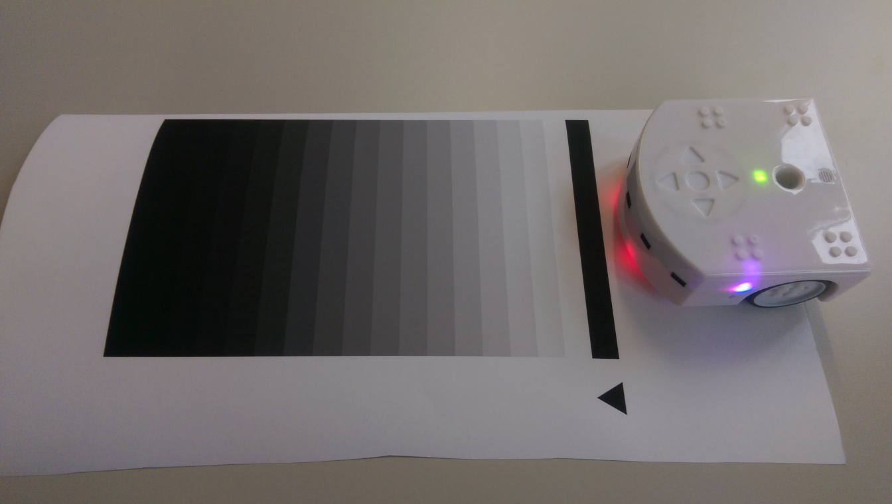
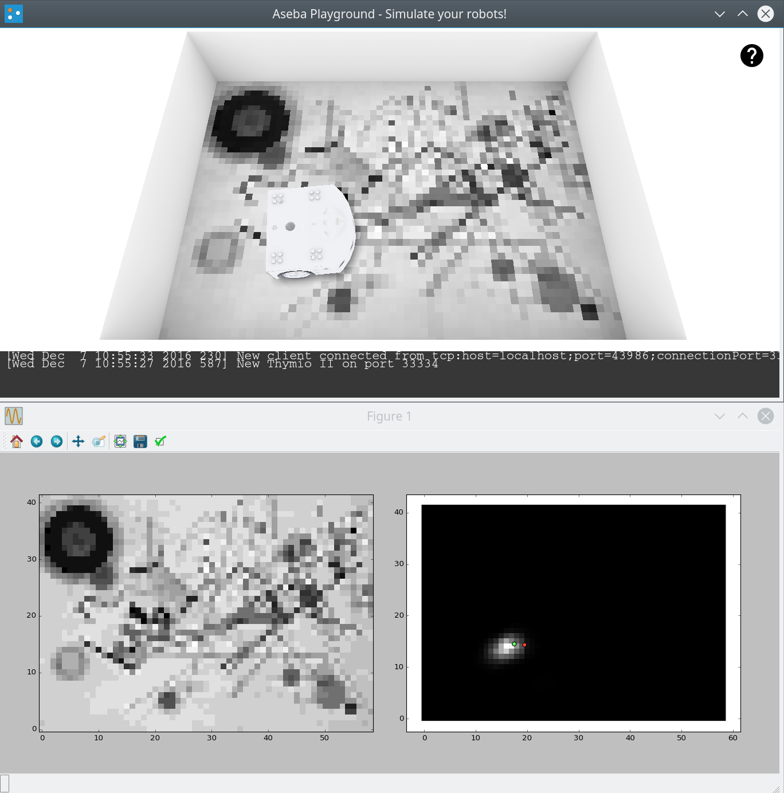

Bayesian global localisation for Thymio using ground sensors
============================================================

This repository holds the source code, recorded VICON data, and the [DARS 2016 paper](http://stephane.magnenat.net/publications/Localization%20of%20inexpensive%20robots%20with%20low-bandwidth%20sensors%20-%20Wang%20et%20al.%20-%20DARS%20-%202016.pdf).

Shiling Wang, Francis Colas, Ming Liu, Francesco Mondada, Stéphane Magnenat

[download](video/thymio-ground-localisation-video.mp4)

Prerequisites
-------------

This code needs Python 2.x, Cython, numpy, scipy, and termcolor.

Real-time localization of Thymio
================================

This can be performed both in simulation or with a physical robot.

Simulation setup
----------------

You need the master branch of Aseba or, when released (sometimes in 2017), version 1.6 or later.
You can download Aseba from [github](https://github.com/aseba-community/aseba).
Once Aseba is downloaded, compile it according to the instructions on github.
Then, first launch playground, open one of the 6 scenarios in the `simulation/` directory or pass it to the command line.
For instance:

    asebaplayground simulation/kandinsky.playground

Then, launch asebamedulla to connect to the virtual Thymio:

    asebamedulla "tcp:localhost;33334" -v

You should see a message indicating an incoming connection to the virtual Thymio, both on medulla and in the bottom part of playground's window.
Keep `asebamedulla` running for next steps.

Real-robot setup
----------------

You need a [Thymio](http://thymio.org), preferably a Wireless version, and the latest stable version of [Aseba](https://www.thymio.org/en:start) installed.
As this real-time localization code uses DBus to communicate with Aseba, you need to have a D-Bus enabled build.
It is the case by default on Linux, for OS X, you might have to recompile Aseba, on Windows, it is not supported.
Assuming your are on Linux, first install the latest stable version of Aseba, as described on https://www.thymio.org/en:start.

First launch asebamedulla to connect to the Thymio:

    asebamedulla "ser:name=Thymio" -v
    
You should see a message indicating an incoming connection to the Thymio.
Keep `asebamedulla` running for next steps.

Calibration
-----------

In simulation, this step is step required.
If you have a real robot, the first thing to do is to calibrate the sensors of your Thymio.
To do so, print and cut the calibration pattern from [data/thymio-ground-localisation-maps.pdf](data/thymio-ground-localisation-maps.pdf), at size 1:1 (one gray line is 1.5 cm).
Position the robot in front of the pattern, perpendicularly to the stripes:

Then launch the `calibrate_thymio.py` in the `code/` directory:

    ./calibrate_thymio.py
    
This program writes the calibration tables in the file `config.json`.

Running
-------

Make sure `asebamedulla` is running.

In simulation, launch the localization program, `localize_thymio.py` in the `code/` directory, passing the filename of the image corresponding to the scenario loaded in playground and the `--simulation` flag, for instance:

    ./localize_thymio.py ../data/kandinsky_comp-8_A2.png --simulation

With a real robot, print one of the six images from [data/thymio-ground-localisation-maps.pdf](data/thymio-ground-localisation-maps.pdf), *without scaling* (1 pixel = 1 cm).
Launch the localization program, `localize_thymio.py` in the `code/` directory, passing the filename of the image corresponding to the printed one, for instance:

    ./localize_thymio.py ../data/kandinsky_comp-8_A2.png
    
The program is running, but to localize, you need to have the Thymio move.
To do so, plug a joypad and launch the `asebajoy` program:

    asebajoy

It will connect to `asebamedulla` and allow to control the Thymio with the two first axes.
For a typical modern gamepad, these axes correspond to the left analog stick.
This has been tested with a _Logitech Wireless Gamepad F710_ (D-mode, Ubuntu 16.04.1), but should work with most joypads.

In simulation, you should see something like that:

Troubleshooting
---------------

The script `localize_thymio.py` opens a window, but it is empty.
We observed a similar problem with some versions of matplotlib on some setups.
You can try to uncomment the statement `matplotlib.use('GTK')` at line 14 of `localize_thymio.py`.

Evaluation of parameters
========================

Once the prerequisites are installed, you can play with existing datasets (in `data/`) using the `test.py` tool (in `codde/`), even if you do not own a robot. If you launch `test.py` with the `-h` argument, it will list its available options.

For example:

    ./test.py --self_test --ml_angle_count 32

runs the synthetic data self tests using Markov localization and 32 discretization for angle.

The command used to generate the video for MCL being:

    ./test.py --eval_data ../data/random_long/ --skip_at_start 180 --duration 200 --prob_uniform 0.1 --custom_map ../data/kandinsky_comp-8.png --fake_observations --sigma_obs 0.1 --mcl_particles_count 200000 --debug_dump ../result/video/mcl --performance_log ../result/video/mcl/log

The rest of this section lists the different options.

Algorithm
---------

There are two algorithms, Markov localization (ML) and Monte Carlo localization (MCL).

ML can be selected by this switch:

    --ml_angle_count
  
A discretization for angles must be given as parameter.

MCL can be selected by this switch:

    --mcl_particles_count

A number of particles must be given as parameter.

Evaluations
-----------

Two types of evaluations can be done with this tool, self test and data evaluation.

Self test can be selected by this switch:

    --self_test

This will test the algorithm on noiseless synthetic data. If a set of parameters do not work with this mode, it is useless to try with real data.

Data evaluation can be selected by this switch:

    --eval_data

A directory from which to evaluate data must be given.

Getting information out of the tests
------------------------------------

In addition to observing the colors in the console, there are two ways to observe the performance of the test.

A log of the test can be requested with `--performance_log`, the argument being the file for logging. In that file, each line will have similar informations for every step.

In addition, images can be dumped with the `--debug_dump option`, taking a directory (hopefully empty) as parameter. The exact information depend on the algorithm, bitmaps are dumped for ML and maps of arrows for MCL.

Parameters
----------

There are different parameters. The main being the arguments to `--ml_angle_count` and `--mcl_particles_count.` In addition, there are these categories:

1. motion model and uniform probabilities: `--alpha_xy`, `--alpha_theta` and `--prob_uniform`. The current defaults have been found by maximum likelihood estimation on data sets "random_1", "random_2" and "random_long".

2. observation model: `--sigma_obs` the standard deviation of the observation model for ground color.

3. implementation cut-off for ML: `--max_prob_error`, can be ignored, but it might be set higher to improve speed at the expense of the accuracy of the probability tables computation.

Controlling which part of the dataset we use
--------------------------------------------

Two additional options allows to control which part of the dataset on want to use.

With `--skip_steps`, only one line every N steps will be used from the dataset. Therefore, we can simulate longer time steps. For instance `--skip_steps 10` will simulate observations only every 1 second.

With `--skip_at_start`, a certain number of steps can be skipped in the beginning of the file, because in some the robot is initially idle. If combined with the previous parameter, its effect will be multiplicative.

With `--duration`, only a certain number of steps will be used. If combined with the previous parameter, its effect will be multiplicative.

Custom map
----------

With `--custom_map`, a custom map can be used. By default `map.png` in the data directory will be used.

Faking observations
-------------------

To use grayscale maps that were not available at record time, the switch `--fake_observations` allows to regenerate observations from map and ground truth.
